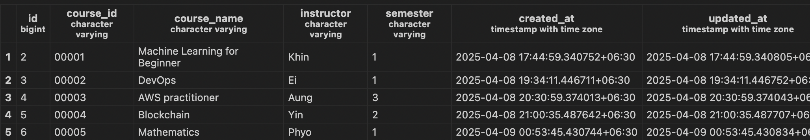
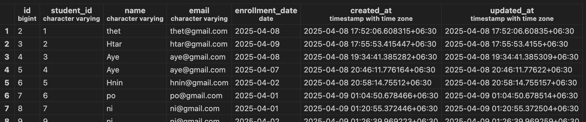
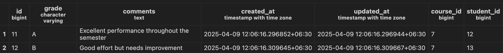
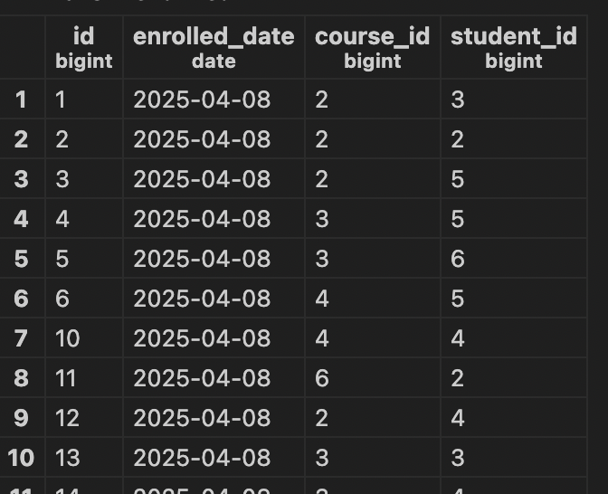
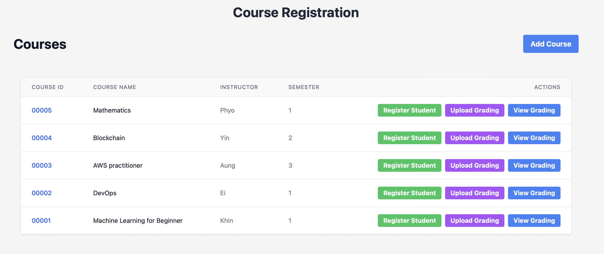
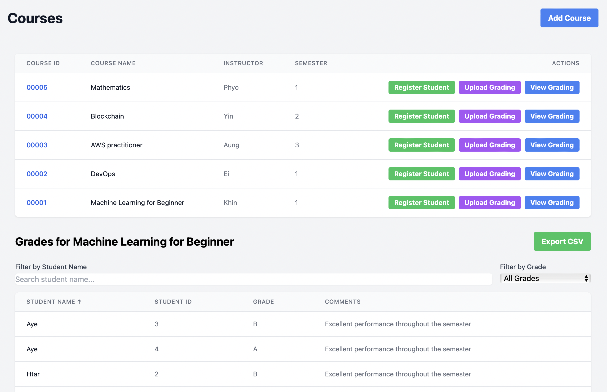
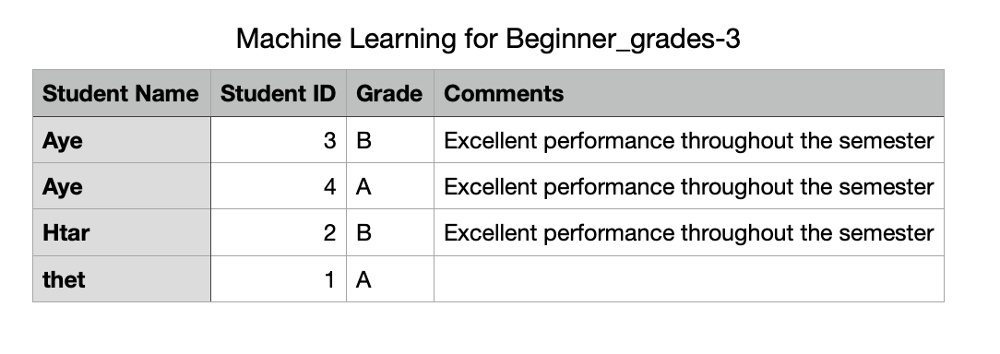

# Course Registration

## API Endpoints

- [Courses](#courses)
- [Students](#students)
- [Enrollments](#enrollments)
- [Grades](#grades)

### 1. Courses

- **GET /api/courses/**  
  List all courses.

- **POST /api/courses/**  
  Create a new course.

- **GET /api/courses/{course_id}/**  
  Get details of a specific course.

- **PUT /api/courses/{course_id}/**  
  Update an existing course.

- **DELETE /api/courses/{course_id}/**  
  Delete a course.

- **GET /api/courses/{course_id}/students/**  
  List all students in a course.

- **GET /api/courses/{course_id}/grades/**  
  List grades for a specific course.

---

### 2. Students

- **GET /api/students/**  
  List all students.

- **POST /api/students/**  
  Create a new student.

- **GET /api/students/{student_id}/**  
  Get details of a specific student.

- **PUT /api/students/{student_id}/**  
  Update an existing student.

- **DELETE /api/students/{student_id}/**  
  Delete a student.

- **GET /api/students/{student_id}/courses/**  
  List all courses that a specific student is enrolled in.

---

### 3. Enrollments

- **GET /api/enrollments/**  
  List all enrollments.

- **POST /api/enrollments/**  
  Enroll a student in a course.

---

### 4. Grades

- **GET /api/grades/**  
  List all grades.

- **POST /api/grades/**  
  Add a grade for a student.

- **POST /api/grades/upload_csv/**  
  Bulk upload grades via CSV.

---

## Database Structure

### 1. Course

### 2. Student

### 3. Grade

### 4. Enrollment

## Frontend UI
### Course List

### Add New Course

### Register Student

### Upload Grading

### View Grading

### Download CSV

